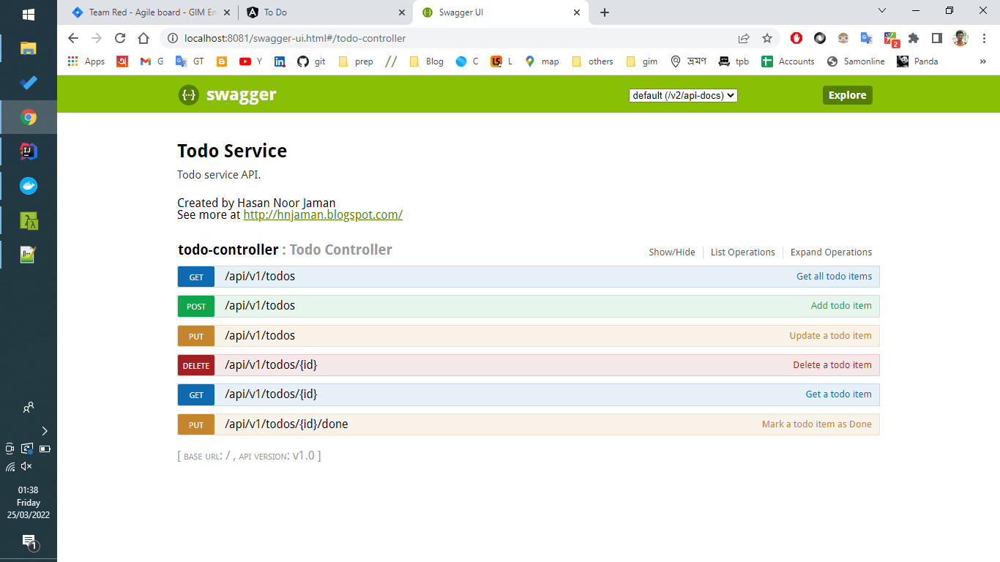
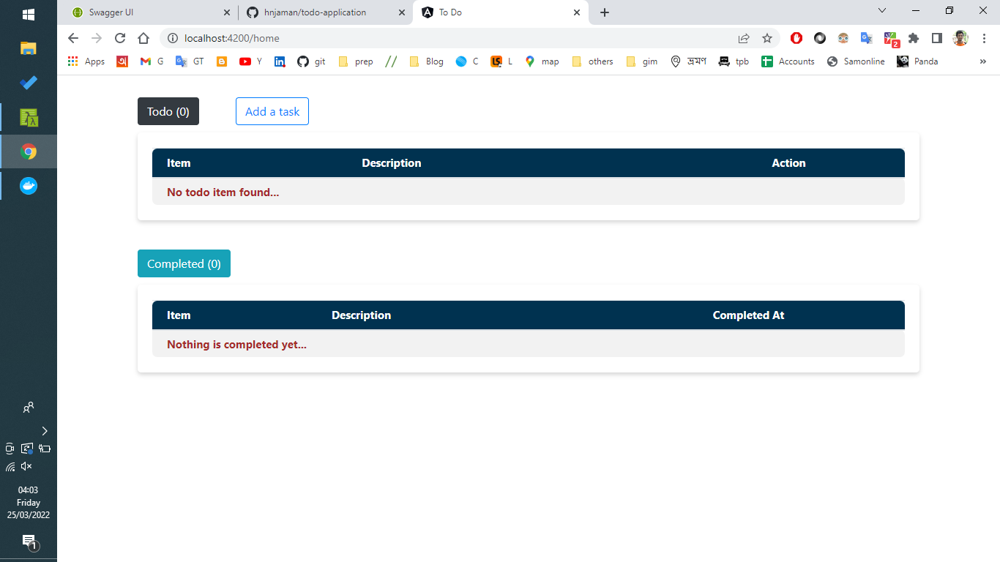
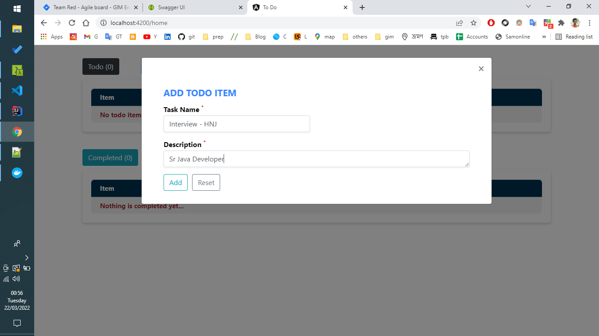
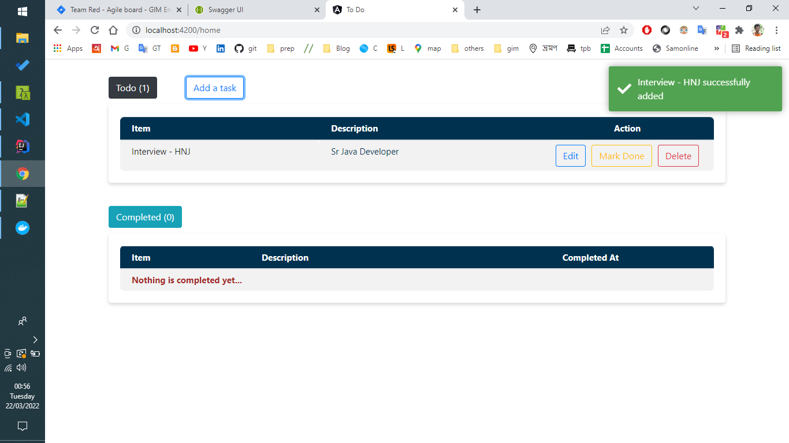

## Technologies used
- Java 8
- Spring Boot
- Spring Data JPA
- JUnit
- Swagger
- MYSQL
- Maven
- Docker
- Angular 

## System configuration prerequisites to run the application
### What should be installed in your machine -
1. Docker

- The application is Dockerized so you no need to configure specific environment
 to run this application just you need to have Docker installed in your computer. 

### Step 1: Clone the project
Open terminal and run
````
git clone https://github.com/hnjaman/todo-application.git
````
In your current directory ``todo-application`` directory will be created.


### Step 2: Run the backend service [Spring Boot]
Move to ``todo-application`` -> ``todo-service`` directory and enter below command from your terminal 
````
docker-compose up -d
````
*Note :* Since a build JAR file already added in the repository inside ``todo-service/target`` is so you no 
need to build it yourself. You can also do it by configuring Java, Maven, MySQL in your system.


#### What will happen after completing ``docker-compose up -d`` ?

1. Pull ```mysql:8``` docker image and run in a container with specified configuration.
2. Pull ```openjdk:8``` docker image, prepare todo-service image and run it in a docker container in 8080 port.


##### Congratulations! backend service is ready.
Visit swagger by http://localhost:8080/swagger-ui.html for checking all backend APIs and you will see


### Step 3: Run the frontend service [Angular]
Move to ``todo-application`` -> ``todo-service-ui`` directory and enter below command from your terminal 
````
docker-compose build & docker-compose up -d
````
The above command will build the angular application, create a docker image and run in a container in 4200 port. 
Visit http://localhost:4200/home and you will see - 



Initially there is no todo in the list. Add a todo item -


Now you will find different action button to edit, mark as done and delete todos.


### The End